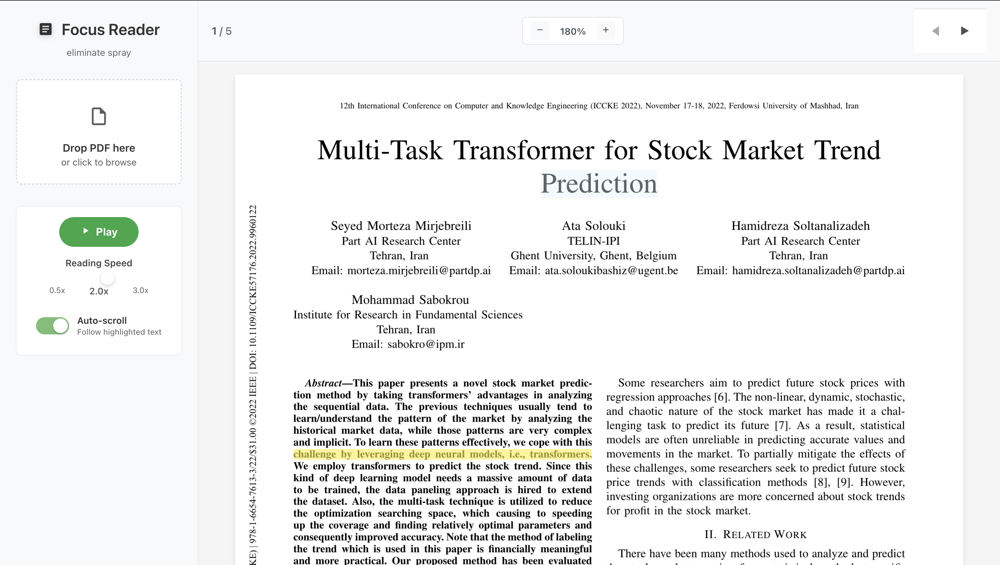

# Focus Reader

A web-based focus reader with synchronized text-to-speech highlighting.



## Run

```bash
npm run dev
```

Opens a PDF viewer with text-to-speech functionality that highlights text as it's being read aloud.